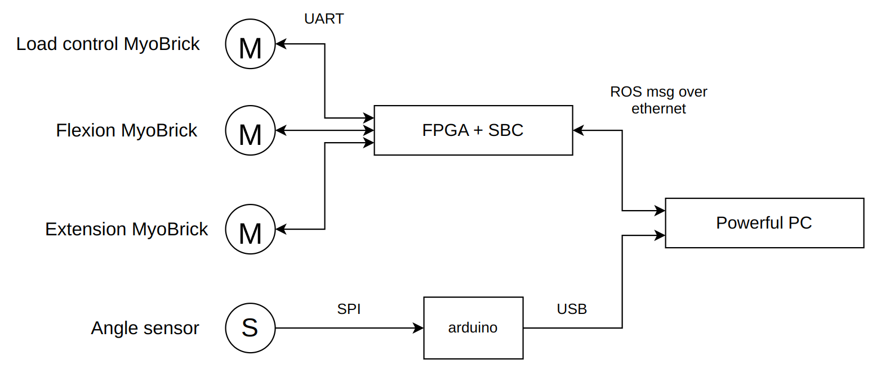
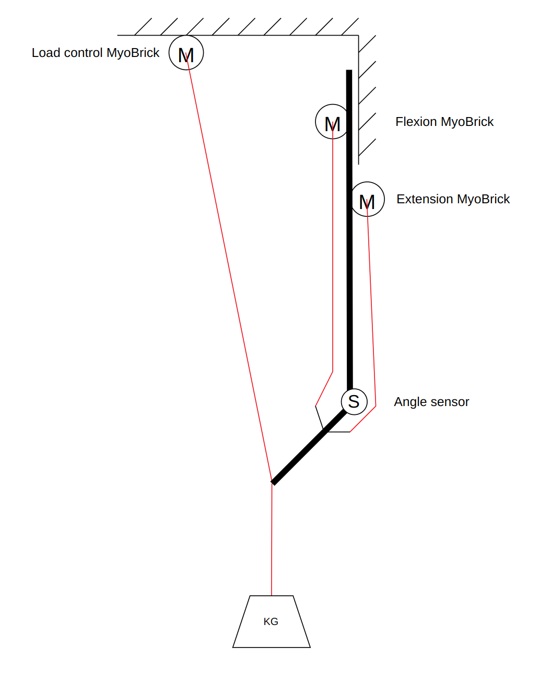

# Joint test bench

# SW

## Bench node

### Desc

The bench node acts as a middle layer between the hardware and the controller. It's tasks are:

- Initilization of motors and sensors after system startup.
- Protecting the hardware from overload by overriding controller.
- Exposing a standardised interface to controller via ROS topics.
- Setting different load scenarios by controlling "Load control MyoBrick"

### How to start
1. Power up:
    - power supply
    - fpga computer
    - prophet computer
2. Connect to Roboy wifi.
3. Start ROS master on prophet computer
    ```
    roscore
    ```
4. Start ROS slave on fpga computer
    ```
    ./roboy_plexus pinky.yaml
    ```
5. Activate roboy conda envireonment on prophet
    ```
    activate_conda
    ```
6. Start bench program
    ```
    cd ~/roboy_team_ws22/w22-test-bench/bench
    python ./bench_main.py
    ```
7. Observe the bench state
    ```
    # Source bench msg types
    . ~/roboy_team_ws22/w22-test-bench/catkin_ws/devel/setup.bash
    # Stream bench state
    rostopic echo /test_bench/BenchState
    ```
8. Test the controls
   
    If the joint is in a unsafe position, the kill will be set automatically immediately after reset and the motors will stop.
    ```
    # Source bench msg types
    . ~/roboy_team_ws22/w22-test-bench/catkin_ws/devel/setup.bash
    # The kill switch is set on startup so it need to be reseted.
    rostopic pub /test_bench/BenchMotorControl bench/BenchMotorControl "{reset_kill_switch: true}" -1
    # The motors are stopped when the kill switch is set, so start them after resetting the kill switch.
    rostopic pub /test_bench/BenchMotorControl bench/BenchMotorControl "{flex_myobrick_start: true, extend_myobrick_start: true}" -1
    # Test the motors, this command will make the joint flex. A watchdog sets the motor pwm to 0 after 0.5 seconds the last pwm command.
    rostopic pub /test_bench/BenchMotorControl bench/BenchMotorControl "{flex_myobrick_pwm: 5, extend_myobrick_pwm: -3}" -1
    ```

### ROS topics
- /test_bench/BenchMotorControl
  - float32 flex_myobrick_pwm
  - float32 extend_myobrick_pwm
  - bool flex_myobrick_start
  - bool extend_myobrick_start
  - bool reset_kill_switch 
  - bool press_kill_switch
- /test_bench/BenchState
  - float32 angle
  - bool safety_switch_pressed
  - float32 flex_myobrick_pos_encoder
  - float32 flex_myobrick_torque_encoder
  - float32 flex_myobrick_current
  - float32 flex_myobrick_pwm
  - bool flex_myobrick_in_running_state
  - float32 extend_myobrick_pos_encoder
  - float32 extend_myobrick_torque_encoder
  - float32 extend_myobrick_current
  - float32 extend_myobrick_pwm
  - bool extend_myobrick_in_running_state


## Data recorder node
### Desc

The data recorder records the state of the bench to a specified CSV file.

### How to start
1. Start the bench node
2. Activate roboy conda envireonment
    ```
    activate_conda
    ```
3. Start recording
    ```
    cd ~/roboy_team_ws22/w22-test-bench/data_recorder
    python ./data_recorder.py dataset.csv
    ```
4. Press CTRL+C to stop recording.

### CSV format
The colunmns of the CSV file are
  - timestamp
  - angle
  - safety_switch_pressed
  - flex_myobrick_pos_encoder
  - flex_myobrick_torque_encoder
  - flex_myobrick_current
  - flex_myobrick_pwm
  - flex_myobrick_in_running_state
  - extend_myobrick_pos_encoder
  - extend_myobrick_torque_encoder
  - extend_myobrick_current
  - extend_myobrick_pwm
  - extend_myobrick_in_running_state

## Controller node

### Desc

The controller node controls the angle of the joint by reading and writing to the different ROS topics exposed by the bench node.


### Controllers
- go_to_middle_pos.py
    
    Makes the joint go to the middle position, then exits.
- go_up_and_down.py
  
    Makes the joint go up and down full range until once presses CTRL+C, then exits.
- reset_kill_switch_and_start_motors.sh
  
    Resets the kill switch and starts the motors, then exits.


## Evaluation node

### Desc

The evaluation node sends waypoints to the controller node and evaluates it's performance.


# HW

## Connection diagram

<p align="center">

</p>

## Mechanical setup

<p align="center">

</p>

